# Master Plan — Building Blocks

A production-quality starter repository providing the reusable core application shell for future projects. Every module below lives in its own folder with a `plan.md` describing its scope, contracts, and build order. Projects inherit from this repo (template repository / fork model) and extend, never rewrite, these blocks.

## Vision

- **One shell, many products.** Auth, tenancy, RBAC, auditing, notifications, files, search, flags, jobs, email, billing, admin, and ops are solved once, here.
- **Boring, proven technology.** Prefer well-supported defaults over novelty. Every dependency must justify itself.
- **Provider-agnostic seams.** External services (email, storage, billing, search) sit behind interfaces with at least one local/dev implementation so the stack runs fully offline via Docker Compose.
- **Inheritance-friendly.** Downstream projects add features in their own vertical slices; core modules expose extension points (events, interfaces, config) instead of requiring edits to core files.

## Stack Decisions (locked)

| Concern | Decision |
|---|---|
| Frontend | Next.js (App Router, TypeScript, Tailwind CSS, shadcn/ui) |
| API | .NET (current LTS) ASP.NET Core Web API, modular monolith, vertical slices |
| Database | PostgreSQL, EF Core (code-first migrations), one schema per concern |
| AuthN | ASP.NET Identity + JWT access / rotating refresh tokens; OIDC social login as extension |
| AuthZ | Custom RBAC (roles → permissions), enforced server-side via policy handlers |
| Tenancy | Organisation → Workspace hierarchy, row-level `organisation_id` scoping |
| Realtime | SignalR (in-app notifications) |
| Jobs | Hangfire with PostgreSQL storage |
| Logging | Serilog (structured) + OpenTelemetry traces/metrics |
| Files | S3-compatible API (MinIO for dev, S3/R2 in prod) |
| Search | PostgreSQL full-text first; pluggable OpenSearch adapter later |
| Email | Provider interface: SMTP/Mailpit (dev), Resend or SES (prod) |
| Billing | Provider-agnostic hooks; Stripe reference implementation |
| Dev environment | Docker Compose (Postgres, MinIO, Mailpit, API, Web) |

## Repository Layout (target)

```
building-blocks/
├── master-plan.md                  ← this file
├── <module>/plan.md                ← one per module (see index below)
├── apps/
│   ├── web/                        ← Next.js app
│   └── api/                        ← .NET solution
├── infra/                          ← docker, compose, CI/CD, IaC
└── docs/                           ← ADRs, runbooks
```

During the planning stage only the plan files exist. Code lands under `apps/` and `infra/` per each module's plan.

## Module Index & Dependency Graph

| # | Module | Folder | Depends on |
|---|---|---|---|
| 1 | Next.js frontend shell | `nextjs/` | — |
| 2 | .NET Core API shell | `dotnet-api/` | — |
| 3 | PostgreSQL | `postgresql/` | 2 |
| 4 | Authentication | `authentication/` | 2, 3 |
| 5 | Organisations, workspaces & teams (incl. org chart) | `organisations-workspaces/` | 4 |
| 6 | Roles, permissions & approvals | `roles-permissions/` | 5 (approvals also use 8, 14) |
| 7 | Audit logs | `audit-logs/` | 5, 6 |
| 8 | Notifications | `notifications/` | 5, 14 |
| 9 | File uploads | `file-uploads/` | 5, 6 |
| 10 | Search | `search/` | 3, 5, 14 |
| 11 | Feature flags | `feature-flags/` | 5 |
| 12 | Error handling | `error-handling/` | 1, 2 |
| 13 | Logging & observability | `logging-observability/` | 2 |
| 14 | Background jobs | `background-jobs/` | 3 |
| 15 | Email delivery | `email-delivery/` | 14 |
| 16 | Billing hooks | `billing-hooks/` | 5, 11, 14 |
| 17 | Admin console | `admin-console/` | 1, 6, 7, 11 |
| 18 | Docker & deployment | `docker-deployment/` | all runtime modules |
| 19 | Seed data & demo mode | `seed-data-demo/` | 4–9, 11 |
| 20 | Reports generation | `reports/` | 6, 8, 9, 14, 15 |
| 21 | Integrations (webhooks out, OAuth connections) | `integrations/` | 5, 6, 8, 14 |
| 22 | AI integration (substrate, no features) | `ai-integration/` | 5, 6, 11, 16 |
| 23 | Task management (baseline vertical + integration testbed) | `tasks/` | exercises 1–22, 24–25; nothing depends on it |
| 24 | Document templates (PDF form generation) | `document-templates/` | 5, 6, 9, 14 |
| 25 | Custom fields, tags & entity rules | `custom-fields/` | 5, 6, 8, 14; hosts: 5, 23 |
| 26 | Queue management (baseline vertical) | `queues/` | 5, 6, 8, 14 (contributes an action into 25); nothing depends on it |
| 27 | Feedback & comments | `feedback/` | 5, 8, 9, 17 |

Dependency-table notes: rows list *primary* build dependencies. Additionally: authentication's email flows need email-delivery basics (sequenced in Phase 2 below); search indexing rides the outbox (14); document-templates optionally consumes custom-field data sources (25); seed-data seeds every entity-owning module including the verticals; the entity-rules `enqueue` action is **contributed by queues (26) into the rules catalogue**, so 25 never depends on 26.

## System Diagram

```mermaid
graph TB
  subgraph CLIENTS["Clients"]
    WEB["Next.js web app<br/>(BFF: auth proxy only — no business logic)"]
    MOBILE["Future mobile app<br/>(token endpoint + push)"]
    MACHINE["API clients<br/>(API keys)"]
  end

  subgraph HOST["ASP.NET Core Host — pipeline: logging → errors → authn → tenant → authz → rate limit"]
    KERNEL["Kernel<br/>Result · domain events · settings registry ·<br/>caching policy · feature-access resolver · transactions"]

    subgraph IDENTITY["Identity & Access"]
      AUTH["Authentication<br/>JWT/refresh · MFA · API keys"]
      TEN["Orgs · Workspaces · Teams<br/>org chart · invitations"]
      RBAC["Roles & Permissions<br/>ACLs · field policies · temp grants"]
      APPR["Approvals engine"]
    end

    subgraph PLATFORM["Platform Services"]
      JOBS["Background jobs<br/>Hangfire · outbox · process mgrs ·<br/>user schedules"]
      EMAIL["Email delivery<br/>templates · suppression"]
      NOTIF["Notifications & Messages<br/>channels · digests · inbox"]
      FILES["Files & Images<br/>presign · variants · quotas"]
      SEARCH["Search<br/>pg FTS → OpenSearch seam"]
      FLAGS["Feature flags<br/>+ org toggles + entitl. gates"]
      AUDIT["Audit logs<br/>tiers · anchors · legal hold"]
      CF["Custom fields · Tags ·<br/>Entity rules"]
    end

    subgraph PRODUCT["Product Surface"]
      BILL["Billing hooks<br/>plans · entitlements · Stripe seam"]
      INTEG["Integrations<br/>webhooks out · OAuth vault"]
      AI["AI substrate<br/>gateway · metering · governance"]
      REPORTS["Reports pipeline<br/>+ filtered-view export"]
      DOCTPL["Document templates<br/>PDF fill · designer"]
      ADMIN["Admin console<br/>platform roles · impersonation"]
    end

    subgraph VERT["Baseline Verticals (optional, removal-tested)"]
      TASKS["Tasks"]
      QUEUES["Queues<br/>+ appointments"]
    end
  end

  subgraph INFRA["Infrastructure"]
    PG[("PostgreSQL<br/>(only hard dependency)")]
    S3[("S3 / MinIO")]
    REDIS[("Redis — optional<br/>SignalR backplane + cache L2")]
    OBS["Serilog · OTel · watchdog<br/>Grafana (optional profile)"]
    EXT["External providers<br/>Stripe · SES/Resend · LLMs · APNs/FCM"]
  end

  WEB & MOBILE & MACHINE --> HOST
  EXTHOOKS["Inbound provider webhooks<br/>(Stripe · email · signed)"] --> HOST

  IDENTITY & PLATFORM & PRODUCT & VERT --- KERNEL
  KERNEL --> PG
  FILES --> S3
  NOTIF -.-> REDIS
  KERNEL -.-> REDIS
  HOST --> OBS
  EMAIL & BILL & AI --> EXT
  INTEG --> EXT

  JOBS ==>|"outbox fan-out"| AUDIT & NOTIF & SEARCH & INTEG
  CF -->|"edge actions"| NOTIF & QUEUES
  APPR -->|"routing"| TEN
  VERT -->|"register into"| RBAC & SEARCH & NOTIF & CF & REPORTS
```



Solid arrows = request/data paths; dotted = optional infrastructure; thick = the transactional-outbox event fan-out that is the primary extension seam.

## Build Order (phases)

1. **Foundation** — dotnet-api (incl. Kernel: settings/caching/transactions/feature-access), nextjs, postgresql, error-handling, logging-observability, docker-deployment (dev compose only).
2. **Identity & tenancy** — background-jobs (outbox core) and email-delivery (SMTP/Mailpit + base templates) **first** — authentication's verify/reset flows depend on them — then authentication, organisations-workspaces, roles-permissions (approvals last within the phase; they consume notifications stubs until Phase 3).
3. **Platform services** — audit-logs, notifications (+ messages), file-uploads (+ images), feature-flags, remaining background-jobs milestones (user schedules, process managers).
4. **Product surface** — search, billing-hooks, reports, integrations, ai-integration, document-templates, **custom-fields/tags/entity-rules** (before the verticals that host them), admin-console, feedback.
5. **Polish & handoff** — seed-data-demo, baseline verticals (tasks + queues — prove every seam end-to-end; CI removal tests), docker-deployment (prod), docs/ADRs, template-repo checklist.

Each phase ends with: migrations applied cleanly from scratch, `docker compose up` green, integration tests passing, and the demo seed loading.

## Cross-Cutting Conventions

- **API style:** REST, JSON, versioned under `/api/v1`. Errors are RFC 9457 `application/problem+json`. Cursor pagination (`?cursor=&limit=`).
- **IDs:** UUIDv7 primary keys everywhere.
- **Timestamps:** `created_at`/`updated_at` UTC on every table; soft delete (`deleted_at`) only where a module's plan calls for it.
- **Tenancy rule:** every tenant-owned table carries `organisation_id` (and `workspace_id` where scoped); EF global query filters enforce isolation — never trust the client for tenant context.
- **Atomicity & resilience:** one policy (dotnet-api plan): one transaction per command (business change + audit + outbox commit atomically); no external calls inside transactions; no distributed transactions — eventual consistency via outbox + reconciliation; Postgres is the only hard dependency, every soft dependency declares its outage behaviour; standard outbound HTTP pipeline (timeout, idempotent-only retries, circuit breaker per provider).
- **Caching:** one policy (dotnet-api plan): Postgres is truth, caches are TTL-bounded (≤60s) with event eviction as fast path, one `HybridCache` abstraction with optional Redis L2, tenant-required cache keys, `no-store` HTTP default. Client side: three TanStack staleTime tiers in the query-key factory.
- **Events:** modules communicate via in-process domain events (MediatR-style) with a transactional outbox for anything that leaves the process. This is the primary extension seam for inheriting projects.
- **Config:** 12-factor; all secrets via environment variables; `.env.example` kept exhaustive and current. **Configuration layering:** env vars = infrastructure/secrets (restart to change); the **settings registry** (dotnet-api plan) = typed runtime behaviour with a platform → org → workspace → user cascade, generated settings UIs, and audited changes; feature flags = exposure/rollout; entitlements = plan-driven limits. Each knob has exactly one home.
- **Testing:** unit tests per module; integration tests with Testcontainers (Postgres); Playwright smoke tests for critical web flows. Environment ladder (dev / per-PR preview / staging / production) defined in docker-deployment plan.
- **Customer-side testing:** hard tenant isolation makes a **sandbox org** the sanctioned way for a customer (or you) to trial config changes — roles, approval policies, webhooks (with test-delivery), flags via org allowlist — before touching the real org. A practice, not a mechanism: document it in onboarding docs; no "org sandbox mode" feature.
- **Frontend/back contract:** OpenAPI generated from the API; typed client generated into the Next.js app on build.

## How Inheriting Projects Consume This

1. Create new repo from this template (or fork).
2. Rename solution/app identifiers via the rename script (planned in `docker-deployment/plan.md`).
3. Delete unneeded optional modules (billing-hooks, search) — each plan lists its removal steps.
4. Add product features as new vertical slices; subscribe to core domain events rather than modifying core handlers.
5. Pull upstream improvements via git merge from the template remote (keep core files unmodified to minimise conflicts).

## Documentation Strategy

**Docs are code:** in-repo markdown, PR-reviewed with the change that makes them necessary, mermaid for diagrams (no binary diagram files). A doc nobody is forced to update will drift — so the strategy leans on generation and CI checks over discipline.

**Four audiences, four homes:**
| Audience | What they need | Where |
|---|---|---|
| Contributors | conventions, how to build/test/run | root `README` (quickstart ≤10 min to running stack), `CONTRIBUTING.md`, module plan.md→README as built |
| Operators | how to deploy, diagnose, recover | `docs/runbooks/` (named inventory: break-glass, data-masking, storage-migration, secret-rotation, restore) + alert-rule docs |
| Inheriting projects | how to extend, configure, remove | per-module README sections (Definition of Done already requires them), `docs/upstream.md`, rename script docs, `CHANGELOG.md` (template releases — what inheriting repos are merging) |
| Auditors/customers | posture and data handling | Security & Privacy Baseline (this file), `docs/data-map.md`, `docs/stress-test-*.md` |
| QA / future upgrades | the edges and their expected behaviour | `docs/edge-case-catalogue.md` — acceptance source per module, regression map per enhancement; maintained by rule (new edge ⇒ new row; tested row ⇒ linked test) |

**Generated beats written (the registries are the documentation):**
- OpenAPI → API reference + typed client (already the contract).
- A `docs generate` build step dumps registry metadata to markdown: **permissions catalogue, settings reference, event catalogue (with public/webhook-visible flags), flag inventory, notification types, audit action registry, scheduled jobs list**. These references are *never hand-edited*; CI regenerates and fails on uncommitted drift — same mechanism as the `.env.example` check.
- Error code catalogue and problem types likewise generated from the typed error definitions.

**Decisions get ADRs:** `docs/adr/NNN-title.md`, lightweight (context → decision → consequences). The master plan's Rejected Alternatives seed the first batch; new architectural choices during build add theirs in the same PR. Plans (`plan.md`) stay as *intent*; ADRs record *what actually happened and why* when reality diverges.

**AI-assistant context:** a lean root `CLAUDE.md` (conventions, commands, where the registries live, links to plan files) maintained like any doc — the shell assumes agentic development and treats assistant context as first-class documentation.

**Explicitly out of scope:** end-user help centers/product docs (product concern), auto-published doc sites (a `docs/` folder readable on GitHub is the bar until a real project needs more).

## Security & Privacy Baseline (index — details live in the owning plans)

**Identity & access:** Argon2id hashing, rotating refresh tokens with family revocation + concurrent-refresh grace, TOTP MFA + org-enforced MFA, aggressive auth rate limits, no user enumeration, session management UI (authentication). Four authorization layers — platform / RBAC / resource ACL / field policy — additive-only, `?explain=` traceable, temporary grants auto-expiring (roles-permissions).

**Tenant isolation:** `organisation_id` on every tenant row, EF global query filters off `ITenantContext`, the cross-tenant regression test as a permanent gate, optional Postgres RLS hardening (postgresql). Tenant-required cache keys by construction (caching policy).

**Data protection:** TLS at the edge; provider encryption at rest; **application-layer encryption for high-value columns** (TOTP secrets, OAuth tokens) and hashing for everything recoverable-by-nobody (passwords, refresh tokens, API keys, recovery codes) (authentication/integrations). Strict CSP + security headers on web and API, verified in CI (nextjs/dotnet-api). Cookies httpOnly/Secure/SameSite via BFF — browser never holds raw JWTs.

**PII discipline (one rule, five enforcement points):** field-policy-guarded data never leaves shaped DTOs — not into logs (user-by-ID only), audit metadata (scrubber), search indexes, exports, or AI prompts. Prompt content unlogged; email addresses in `citext` columns, not logs.

**Privacy rights (GDPR-shaped):** right to erasure via account deletion + anonymising tombstones; data export (`me/export`); retention windows per data class (audit 400d default, email logs 90d, notifications 90d) enforced by jobs; prod data never leaves prod except through the masking runbook. **PII inventory:** each module's plan/README declares what personal data it stores and why — assembled into `docs/data-map.md` (the Art. 30-shaped record) as modules are built.

**Boundary defenses:** SSRF guards on customer URLs (webhooks), HMAC-signed webhooks both directions, magic-byte file validation + EXIF strip + AV seam + quarantine, presigned-URL-only file access, model output treated as untrusted input (integrations/file-uploads/ai-integration).

**Operational security:** secrets in env/KMS only (settings registry rejects them), gitleaks/CodeQL/Trivy blocking in CI, non-root distroless containers, platform-admin MFA + impersonation guardrails + break-glass runbook, security events → audit + user notification (docker-deployment/admin-console).

**Deliberately deferred (documented, not forgotten):** data residency/multi-region, SOC 2 tooling, SAML/enterprise SSO (schema-ready), column-level encryption beyond high-value fields, bug-bounty/disclosure policy (add `SECURITY.md` at first public deployment).

## Rejected Alternatives (recorded decisions)

- **Universal business-object engine** (metadata-driven / EAV / generic-JSONB entities instead of concrete typed objects) — **rejected.** It forfeits FK integrity, typed columns, indexes, EF migrations, and the OpenAPI→TypeScript typed-client chain, and makes every cross-cutting module (audit, search, ACLs, field policies, seeding) generic-case hard. The shell instead standardises **universal behavior seams over concrete types**: the registry patterns (permissions, searchable entities, resource ACLs, approvable actions, notification types, file purposes, field policies) give cross-cutting uniformity while objects stay typed and boring.
  - *If a product needs runtime user-defined objects* (CRM/no-code style), build a `custom_object` module as that project's product vertical inside a workspace — on top of the shell, never as its foundation.
  - The lightweight **custom-fields module is now planned** (module 25: per-org definitions + opt-in JSONB on host entities, incl. derived fields with a closed operation catalogue) — it covers most extensibility requests without an object engine, and its non-goals (no formula language, no cross-entity rollups) are where the object-engine rejection continues to hold.
- **BI / custom report builder** (user-defined queries, dashboard designers, charting engines) — **rejected.** The shell ships the reusable 20% instead: the **reports pipeline** (`reports/` module) for data-out, and the **dashboard kit** (nextjs plan: Recharts/shadcn chart components, stat tiles, date-range handling, server-aggregated stats-endpoint convention) for developer-built dashboards. Product dashboards are verticals; genuine BI needs are met by embedding an existing tool (e.g. Metabase against a read replica) or exporting to a warehouse — both project add-ons, not shell concerns.
- **Generic workflow engine** (BPMN designer, homegrown durable-execution runtime, user-defined automation) — **rejected.** The shell's combination already covers the real cases: approvals engine = human-in-the-loop workflow; events + outbox + Hangfire + the **process-manager pattern** (background-jobs plan) = system orchestration. Building a generic engine means reimplementing state versioning, compensation, timers, and a debugging UI — an existing product (Temporal/Elsa), adoptable later behind the `IJobScheduler` seam if a project outgrows the pattern.
  - *If a product's feature is customer-built automation* (Zapier-style triggers/actions), build it as a product vertical on top of the domain-event registry — the trigger catalogue already exists, and the `integrations/` module supplies the delivery/credential plumbing it would need.
- **App marketplace / integration directory** (third-party apps installable by customers, developer program, per-app review) — **rejected.** The `integrations/` module ships the reusable substrate (outbound webhooks, OAuth connection vault, provider registry); a marketplace is a business function, not shell code.

## Definition of Done (per module)

- `plan.md` decisions reflected in code with no undocumented deviations.
- Migrations idempotent from empty database.
- Unit + integration tests, wired into CI.
- Seed data updated if the module owns entities.
- Admin console surface added if the module is operator-facing.
- README section: how to configure, extend, and remove the module.
